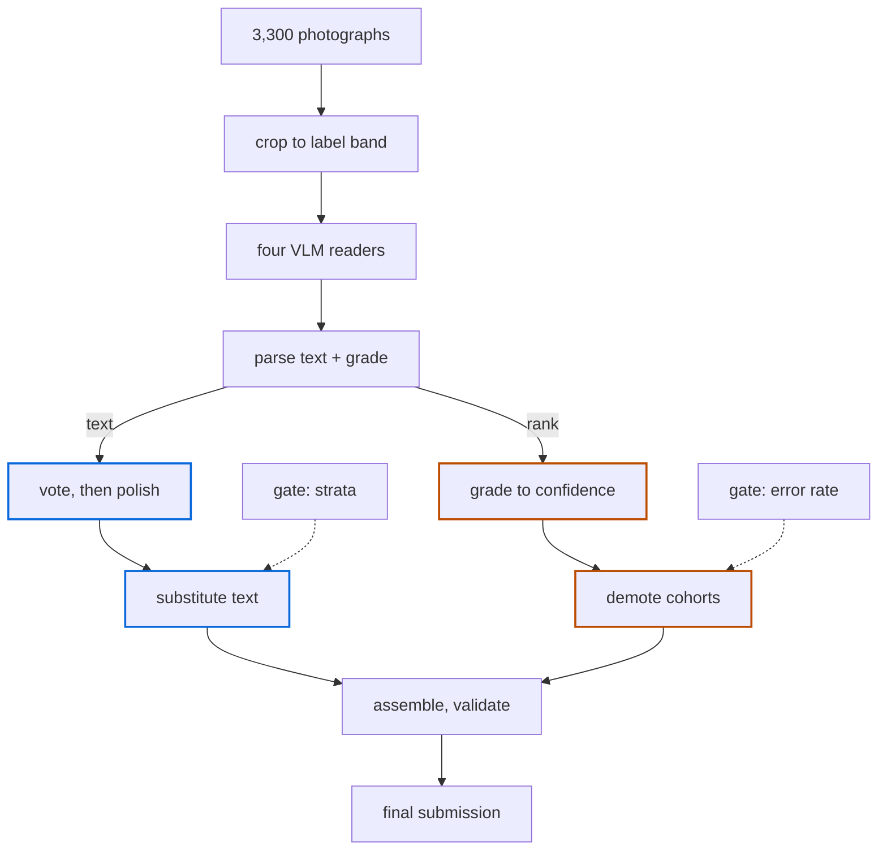

# MuseumSCAT

Reading the collection date and locality off 3,300 handwritten museum specimen labels, and
knowing which of those readings to trust.

**Md Raihan, Mathias Zinnen, Vincent Christlein**, Pattern Recognition Lab,
FAU Erlangen-Nürnberg.

Final: **private 0.02300 / public 0.02203**, rank 14, 85 submissions.
Journey: `0.10743 → 0.03336 → 0.02997 → 0.02928 → 0.02606 → 0.02474 → 0.02263 → 0.02203`.

The findings below are ordered by how well we think they transfer to other collections, rather
than by how much score they bought us.

---

## The system

1. **Tag crop** of each specimen from the 8192×5464 original.
2. **Four VLM readers, independently**: qwen2.5-VL-7B, qwen3-VL-32B, GPT-4o, Claude Sonnet 5.
3. **Per-row majority vote**, then `polish`: the Danish fold, the macron strip, and a generous
   pipe split.
4. **Confidence column** from the reader's own legibility grade, a fixed lookup
   (`clear` 0.92, `absent` 0.85, `partial` 0.55, `unreadable` 0.20). A gradient-boosted ranker
   fitted on the 200 labels was validated five-fold, **grouped by gold locality cluster**, and
   then not shipped: wholesale re-ranking went 0 for 8. Ungrouped folds leak badly, because the
   same locality recurs across trays.
5. **Text substitution**: gemini-3.7-flash re-reads and *replaces* the vote output, but only in
   agreement strata that clear a bootstrap bar.
6. **Cohort demotion**: rule-defined cohorts pushed to the back of the ranking, order otherwise
   untouched.



| stage | what it does | script |
|---|---|---|
| tag crop | crops the 8192×5464 photograph down to the label band, with a fallback | `crop_tags.py` |
| read | one pass per reader: four readers, plus a second draw of one. Every raw response is cached, so the pass is resumable and re-scorable | `run_reader.py` |
| parse | each response becomes a date, a locality, and a legibility grade per field | in `run_reader.py` |
| vote and polish | majority vote, then the Danish fold, the macron strip and the pipe split. Adds the agreement stratum and the base confidence | `build_ensemble.py` |
| substitute | a stronger reader replaces text in the allowed strata only, and is never permitted to turn an answer into `MISSING` | `substitute.py` |
| assemble | writes the competition format and validates it before upload | `build_submission.py` |
| demote | pushes the self-disagreement and self-contradiction tiers to the back of the order | `apply_cohorts.py` |

The two branches are the point. Every row carries both a text and a confidence, and each stage
writes exactly one of them: substitution rewrites text and leaves the ranking alone, demotion
rewrites the ranking and leaves text alone. That invariant is what let the two final submissions
be proved byte-identical in text and different only in ordering. The branches are drawn by which
column a stage writes, so note that in execution the demotion step runs on the assembled file.

Nothing else crosses in from the 200 labelled rows except the two **gates**: which agreement
strata a stronger reader may overwrite, and the rule that a cohort ships only at a 100% error
rate. The gradient-boosted ranker, the only component actually fitted, has no arrow in at all,
because wholesale re-ranking went 0 for 8 on the hidden test set.

Baseline of the four-reader system (out-of-fold on the 200 labels): locality mean NED 0.157,
AURC 0.0958; date 0.047 and 0.0347.

---

## What we would tell a museum

### 1. Reader disagreement localises risk almost perfectly

Partitioning the 200 labelled rows by the agreement pattern of four readers:

| stratum | n | share of AURC weight | share of AURC loss |
|---|---|---|---|
| 4–0 unanimous | 52 | 27.5% | **5.9%** |
| 3–1 | 39 | 21.9% | 6.9% |
| 2–2 | 3 | 1.8% | 3.3% |
| 2–1–1 | 55 | 27.8% | 31.2% |
| 1–1–1–1 | 51 | 20.9% | **52.7%** |

The two largest disagreement strata hold **106 of 200 rows and 83.9% of the locality AURC
loss**. Unanimous reads take 27.5% of the metric's weight and contribute 5.9% of its loss.

In practice you do not need a trained confidence model to triage a digitisation backlog. Run two
readers, send the disagreements to a curator, auto-accept the rest. The winning entry measured
the same thing on the full test set: 2% error where two readers agree, 38% where they disagree.

### 2. A stronger reader should *substitute*, not *vote*

This was our main result. A fifth reader added as an extra **vote** cannot overturn a read that
already holds a plurality, so it never touches the 2–1–1 stratum, which is where replacing the
text pays most:

| stratum | ΔAURC from substitution | P(better) | reachable by a 5th vote? |
|---|---|---|---|
| 4–0 | −0.0015 | 0.534 | no |
| 3–1 | −0.0027 | 0.725 | no |
| 2–2 | −0.0027 | 0.855 | yes |
| 1–1–1–1 | −0.0156 | 0.997 | yes |
| **2–1–1** | **−0.0185** | **0.999** | **no** |

P(better) is a clustered-bootstrap win fraction, not a p-value.

**The value of a stronger reader falls monotonically with agreement, and reverses.** On held-out
data: complete disagreement −0.00309, 2–1–1/2–2 −0.00030, **3–1 +0.00164 (harmful)**. Substituting
into rows where three of four readers already agree makes things worse. Restricting substitution
to the strata that clear the bar moved us 0.03336 → 0.02997.

### 3. Perturb the ordering; never replace it

Across 85 submissions, on the hidden test set:

- **order-preserving cohort demotion: 8 for 8**
- text substitution: 4 for 4
- **wholesale confidence re-ranking: 0 for 8**

Every attempt to replace the confidence column with a better-looking one regressed, including
two that reached P(better) = 1.000 locally. Moving a rule-defined cohort to the back while
leaving everything else in order worked every time. The winning entry states the same
rule from the other direction: *only lower confidence, never raise it*.

### 4. Rank by expected error *magnitude*, not error probability

AURC weights a wrong row by how wrong it is. A false `MISSING`, where the model emits nothing
but the gold record has text, scores NED 1.0, the worst a row can score, and our system was
emitting them at high confidence. Demoting rows where the model's own JSON contradicted itself (it noted
reading a locality, then emitted `MISSING`) was the single largest win of the campaign, −0.00403.

Break-even precision for such a cohort is only **29%** (locality) / **9%** (date), against the
roughly 98% we had assumed a verifier needed. We had already abandoned a working verifier for
missing a bar that never applied to it.

### 5. Where the residual error is

Weighted by AURC cost, not by row count:

| | locality | date |
|---|---|---|
| multi-card / segment selection | **49.0%** | 5.3% |
| false `MISSING` | 18.4% | **67.6%** |
| partial read | 16.7% | — |
| character substitution | 13.1% | 27.1% |
| historical-variant normalisation | 2.8% | — |

**Locality error is not an OCR problem.** Pipes are metric-canonical (joining segments changes
NED by 0.0003), so the loss sits in which physical cards get transcribed, and in presence and
absence decisions. Better handwriting recognition would not touch the dominant failure mode.

### 6. Reader choice, briefly

gemini-3.7-flash was the best reader we found and also the cheapest. It beat Opus-5 head to head
on hard rows at roughly a ninth of the cost, and every GPT-5.6 tier we tested was far worse.
Few-shot image exemplars hurt (+0.0018); showing the model example labels seems to make it
pattern-match rather than read.

### 7. A measurement trap

**gemini-3.7-flash is not deterministic at temperature 0.** Only 34 of 40 localities reproduced
on a byte-identical re-read. A single-run n=200 reader A/B therefore has a noise floor around
±0.002, which is the size of the effects we were chasing. We only found this because one
experiment happened to include a control arm that changed nothing. We would always include one
now.

---

## What is in this repository

```
README.md                     this write-up
docs/story.md                 the full campaign, start to finish: every phase, every
                              tool, what worked, and what didn't
config.yaml                   every tunable in one place, mirroring the numbers above

museumscat/                   the pipeline, as an installable package
  metric.py                   NED + AURC, our implementation of the challenge metric
  crop.py                     tag-region cropper, with the fallback that keeps it honest
  readers.py                  OpenRouter + direct Gemini clients, one shared encoder
  prompts.py                  the reader prompt and the legibility -> confidence map
  parsing.py                  raw response -> fields + legibility grades
  polish.py                   the Danish fold, the macron strip, pipe generosity
  consensus.py                agreement strata, majority vote, frozen-rank substitution
  ranker.py                   the learned confidence ranker (a challenger, not shipped)
  cohorts.py                  the demotion operator and the shipped cohort rules
  submission.py               assemble, validate, and diff two submissions

scripts/                      one thin CLI per pipeline stage
  crop_tags.py                crop every photograph to its label band
  run_reader.py               run one reader, cache every raw response, resumable
  build_ensemble.py           vote + agreement stratum + base confidence
  substitute.py               let a stronger reader replace text in chosen strata
  fit_ranker.py               fit the ranker and report grouped-OOF AURC
  apply_cohorts.py            demote cohorts; prints error rate and weight held
  build_submission.py         assemble, validate, or --compare two finals
  evaluate_submission.py      local AURC + the ordering/reading decomposition

examples/                     synthetic stand-ins, so the pipeline runs with no real data
tests/test_core.py            30 tests, one per claim this write-up makes
results/*.csv                 the nine aggregate tables behind every number above
```

Every number in this write-up is generated from `results/`. Nothing is retyped by hand.

## Quickstart

Nothing here needs the competition data or an API key to run. `examples/` holds fabricated
rows with the same shape as the real thing:

```bash
pip install -e ".[dev]"
pytest -q

# score a submission, and see how much of the loss is ordering rather than reading
python scripts/evaluate_submission.py \
    --submission examples/submission.csv --train examples/train.csv

# demote the two cohorts, then prove the text did not change
python scripts/apply_cohorts.py \
    --submission examples/submission.csv \
    --reads examples/reads_a.csv --reads-b examples/reads_b.csv \
    --field locality --disagreement --contradiction \
    --train examples/train.csv --out /tmp/demoted.csv

python scripts/build_submission.py --compare examples/submission.csv /tmp/demoted.csv
```

On the toy data that takes locality AURC from `0.23705` to `0.03795`, with both text columns
reported `identical`. That is the argument of this write-up, in two commands.

To run it for real, point `config.yaml`'s `data.root` at the competition data (or set
`MUSEUMSCAT_DATA`), export `OPENROUTER_API_KEY` or `GEMINI_API_KEY`, and work through
`scripts/` in the order listed above.

**The per-row predictions are deliberately not redistributed.** They carry the gold
`verbatimDate` / `verbatimLocality` strings from the competition's training split, and
republishing challenge data may conflict with Kaggle's terms. Every aggregate derived from them
is committed here in `results/`, and every number in the write-up above comes from those files.

## Citing

> Md Raihan, Mathias Zinnen, Vincent Christlein. *Agreement-Aware Selective Prediction for
> Museum Label Transcription.* Accepted as a non-archival abstract and poster at the
> [Computer Vision for Natural Heritage (CVNH) workshop](https://computer-vision-for-natural-heritage.github.io/),
> ECCV 2026, Malmö, 8 September 2026.

## Licence

Code (`museumscat/`, `scripts/`) is MIT. The write-up text and the aggregate tables are
CC BY 4.0. The competition images and ground truth are not ours to license and are not included.
See the [MuseumSCAT dataset page](https://kaggle.com/competitions/museumscat-specimen-collection-annotation-task)
for their terms.

## Contact

Md Raihan, `md.raihan@fau.de`, Pattern Recognition Lab, Department of Computer Science,
Friedrich-Alexander-Universität Erlangen-Nürnberg.

Happy to answer questions about any of the tables above.
